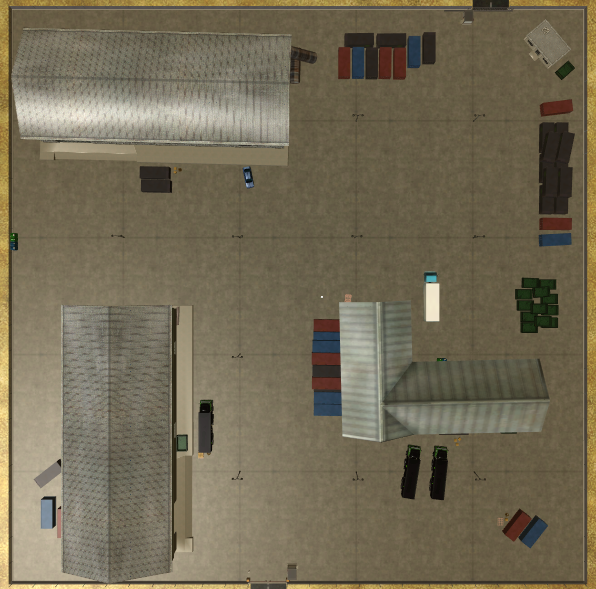

# Map_Maker

## Introduction

Exploration of an unknown environment is a fundamental problem in the field of 
autonomous mobile robotics. It deals with the task of examining the environment with 
sensors while creating a map with its collected data. Conventionally, humans map the 
environment beforehand in order to use theresult in a vehicle for subsequent navigation.  
However, exploration has the potential to remove humans from the loop of generating a 
map of an unknown environment. This has many applications such as robot deployment in 
areas where pre-mapping is not possible, space robotics, etc..

## Goal

The main goal of this project is to design a robot control software for a Robosoft 
Kompai robot in the simulated factory environment MRDS with a hybrid deliberative/reactive 
architecture,allowing the robot to navigate the environment while constructing a map of it.

## Results

