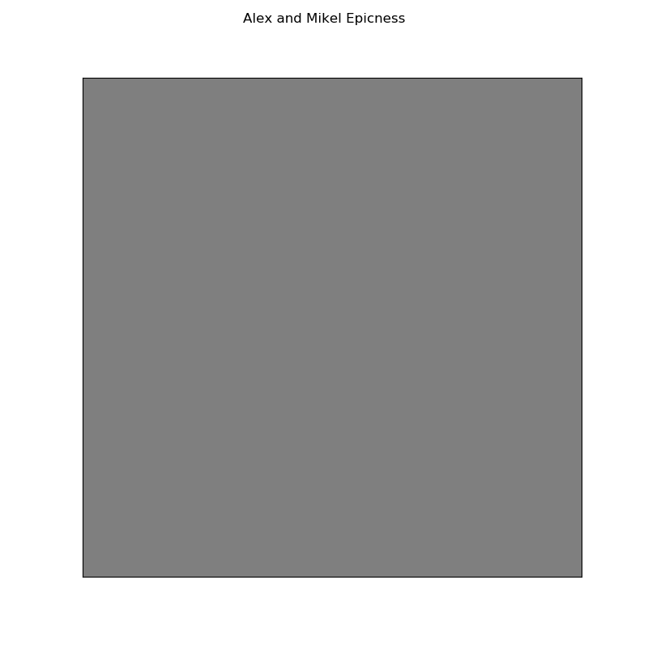
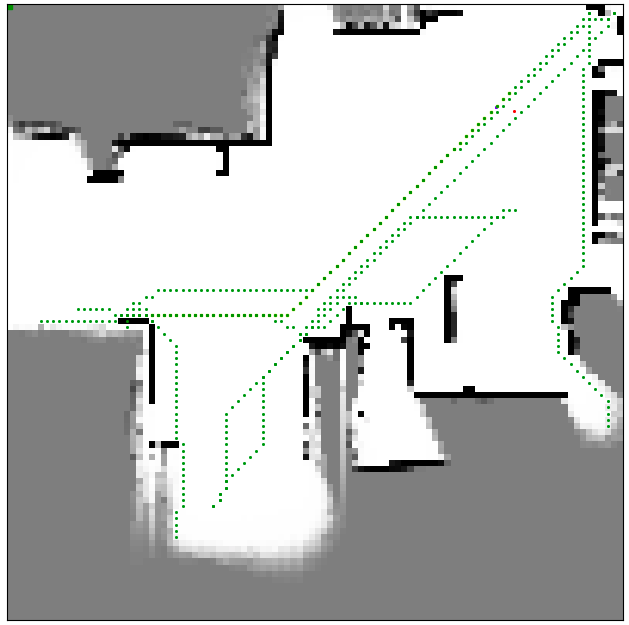

# Map Maker

## Introduction

Exploration of an unknown environment is a fundamental problem in the field of 
autonomous mobile robotics. It deals with the task of examining the environment with 
sensors while creating a map with its collected data. Conventionally, humans map the 
environment beforehand in order to use theresult in a vehicle for subsequent navigation.  
However, exploration has the potential to remove humans from the loop of generating a 
map of an unknown environment. This has many applications such as robot deployment in 
areas where pre-mapping is not possible, space robotics, etc..

## Goal

The main goal of this project is to design a robot control software for a Robosoft 
Kompai robot in the simulated factory environment MRDS with a hybrid deliberative/reactive 
architecture,allowing the robot to navigate the environment while constructing a map of it.

## Run instructons

1. Launch a simulation environment in MRDS
2. cd to the directory where the source files are contained
3. The program takes in five arguments

```bash
./mapper url x1 y1 x2 y2 
```

where url specifies the address and port to the machine running MRDS.x1, y1 represents the coordinate of the lower left corner and x2, y2 of the upper right corner of the area that the robot needs to explore and map. Example:

```bash
./mapper http://localhost: 50000−30−20 40 50
```

Note that these coordinates are given in the coordinate system of thefactory environment

## Results

  
